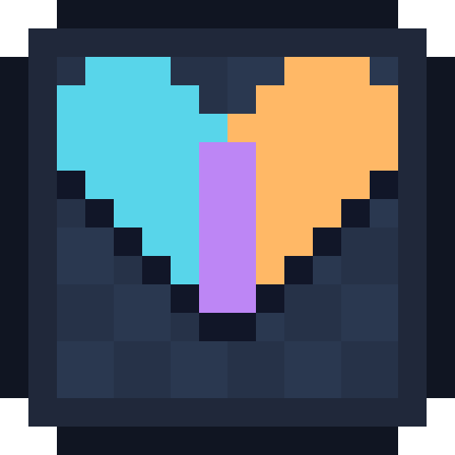

# Collabsprite — English guide

[Deutsch](README.md) · [Download v0.6.5 beta](https://github.com/Merthius/Collabsprite/releases/download/v0.6.5/Collabsprite.aseprite-extension)

Version **0.6.5 beta** includes hosting and joining in **one installer**, with a bundled Windows x64 host runtime. No separate Node.js installation is needed. The archive now identifies itself correctly as Collabsprite, fixing the accidental “ws 8.21.3” installation prompt. Development-version updates are supported.

**Diagnostics are included in every build.** Open **Ansicht → Collabsprite → Diagnosekonsole → Protokoll kopieren** after an error. The local `%TEMP%\Collabsprite-debug.log` survives restarts and is bounded to 512 KiB. It contains technical events, not image data or invitation codes. Use **Neues Protokoll** only before reproducing an error. Guards prevent nested timer dispatch during permission dialogs; the reported guest-PC “C stack overflow” still needs a retest on that PC.

Collabsprite is an unofficial, open-source Aseprite extension for drawing together on the same pixel-art canvas. The host runs a small local server; everyone uses the **same** extension. Per-user undo/redo applies to synchronized pixel operations without removing newer contributions by someone else.

*The image is a schematic guide, not an Aseprite screenshot.*

> [!WARNING]
> **Windows beta.** Direct LAN connectivity was tested with two clients using one PC's LAN address. End-to-end use on two separate PCs, Radmin VPN, Windows firewall approval, and the native Aseprite UI still need testing. Save your work regularly as an `.aseprite` file.

## Requirements

| | Host | Guest |
| --- | --- | --- |
| Aseprite | Yes | Yes |
| `Collabsprite.aseprite-extension` | Yes | Yes — same version |
| Windows 10/11 x64 | Yes, host runtime bundled | Yes |
| [Radmin VPN](https://www.radmin-vpn.com/) | Only across different networks | Only across different networks |

The session server runs on the **host PC** (port `8766`). There is just **one workflow**: Create or Join. Separate PCs on the same Wi-Fi/LAN connect directly without Radmin. Across different networks, both users first join the same Radmin VPN network and then use the same buttons. No cloud account or public Collabsprite server is involved.

## Install on every computer

1. On the [v0.6.5 release page](https://github.com/Merthius/Collabsprite/releases/tag/v0.6.5), download **`Collabsprite.aseprite-extension`** from **Assets**. Do **not** use GitHub's automatically generated “Source code (zip)” as the installer.
2. In Aseprite, open **Edit → Preferences → Extensions → Add Extension** and select the file. Double-clicking the extension may work as well ([official Aseprite instructions](https://www.aseprite.org/docs/extensions/)).
3. Restart Aseprite. Open **View → Collabsprite → Create / Join Server** (German UI: **Ansicht → Collabsprite → Server erstellen / beitreten**).

## Updating an older installation

Save the session copy and disconnect. Add the new **`Collabsprite.aseprite-extension`** in Aseprite's extension settings and confirm the update of **pixelkollab-native / Collabsprite** to **0.6.5**. Restart Aseprite on every participating PC and check **Ansicht → Collabsprite → Info**. The technical package ID stays the same for update compatibility.

The **Update** menu downloads a verified installer into Downloads; then install that file as above. On a broken older build, download directly from GitHub. An older prompt for **“ws 8.21.3”** was caused by our archive layout, not by choosing the wrong file. Reinstall the corrected package. GitHub's source-code ZIP is not the installer.

## Host

1. Open an RGB sprite. Collabsprite creates a **separate session copy**; the original file is not modified.
2. Open **View/Ansicht → Collabsprite → Create / Join Server** (the extension's controls currently use German labels), enter your name and select Create/Erstellen. If your friend is on a different network, start Radmin VPN and join your shared VPN network first.
3. Click **Create session/Sitzung erstellen** and wait for **Connected/Verbunden**.
4. Click **Copy invitation/Einladung kopieren** and privately send the full code to your friends.

Collabsprite does not open Radmin automatically because it is unnecessary on a shared LAN. Windows may request approval for limited firewall rules on the first start; the extension cannot bypass this. For direct LAN access, set the host's Windows network profile to **Private**.

## Join

1. Install the same extension, restart Aseprite, and choose **View/Ansicht → Collabsprite → Create / Join Server → Join/Beitreten**. You do not need to open a sprite first.
2. Only if you are on different networks, start Radmin VPN and join the host's VPN network.
3. Paste the full **invitation code** and click **Join/Beitreten**. Collabsprite tries the listed LAN/VPN addresses. You may also search for active sessions; if discovery finds nothing, use the code.
4. Wait for **Connected/Verbunden** and draw in the shared session copy.

An invitation may look like `192.168.1.10:8766,26.1.2.3:8766/ROOM/TOKEN`; without an active Radmin adapter, there is no `26.…` address. The entire code is a **session access key**. Never publish it in an issue or screenshot. If Radmin starts after the session, click **Copy invitation** again.

## Working together

- Standard Aseprite drawing tools and **completed** selection, paste, fill, and move operations sync. A held stroke or floating selection is not streamed live.
- Any participant can append raster layers and frames and duplicate an existing layer using ordinary Aseprite commands. Single or multiple selected layers/frames can be deleted; deleting a group removes its children. Layer name, visibility, edit lock, opacity and blend mode; frame duration; cel opacity/Z-index; and the first palette sync. Reordering and some complex structure changes are still blocked.
- `Ctrl+Z` / `Ctrl+Y` affect your own synchronized **pixel** actions. Layer/frame creation is not part of that pixel history.
- Save the session copy as `.aseprite` with **Save As**. The host also keeps local session backups, but they do not replace manual saves. Older backups never block a new host; Collabsprite restores the eight most recently changed sessions and leaves older files untouched.
- Closing the host's session image or Aseprite stops the background server after saving its backup and releases port `8766`. Guests are disconnected and should save their local session copies.
- After a network interruption, there is no automatic reconnect or offline merge. Save the local copy and join deliberately again.

The WebSocket connection has **no built-in end-to-end encryption**; use only a trusted LAN or VPN. The host checks and orders changes. The invitation code must remain private. Firewall rules limit inbound TCP/UDP port `8766` to the local subnet on private/domain networks and Radmin's `26.0.0.0/8` range for the Node process.

## Limitations and support

RGB/RGBA raster layers are supported, with limits of 8 participants, 1024×1024 pixels, 32 layers, 120 frames, and 4,194,304 cel-pixels. Tilemaps, reference layers, tags, slices, color profiles, linked cels, and animated palettes are not fully synchronized. Selections, zoom, and color choices remain personal workspace state. **Version 0.6.5 still uses protocol 3; 0.5.0 sessions are incompatible.** See [technical notes](docs/technical-notes.md) and [open issues](https://github.com/Merthius/Collabsprite/issues).

The bundled, unmodified Node.js 24.21.0 runtime carries its full notices in `runtime/LICENSE`. Collabsprite is [MIT-licensed](LICENSE) and is not affiliated with Aseprite or Radmin VPN. Contributions are welcome; see [CONTRIBUTING.md](CONTRIBUTING.md).

## Logo

The cyan and orange halves form one pixel heart: two people, one shared image. Use the [512 × 512 PNG](branding/collabsprite-icon-512.png) for Discord or the [scalable SVG](branding/collabsprite-icon.svg). A [GitHub social preview](branding/collabsprite-social-preview.png) is also included. These graphics are MIT-licensed like the code.
