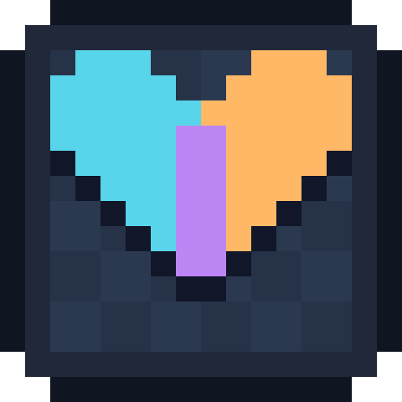
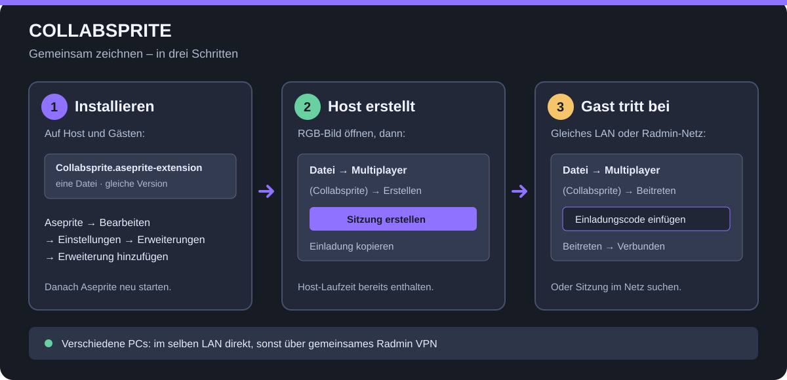

# Collabsprite — English guide

> **Locally prepared: 0.12.1 beta.** Cooperative board/image preparation, fixed PNG/JPG sketch import, reliable discovery and a checkmark that turns the sheet into a full-resolution board image. Not published yet; download links below still point to public 0.12.0. All participants using 0.12.1 need protocol 14 / notes format 9. [Changes (German)](docs/releases/v0.12.1.md).

> **New in 0.12.0 beta:** A native pixel-perfect idea board, animation cards and shared sketch sheets. Pen: 5–20 px; eraser: 5–100 px. The server stops when its host image or Aseprite closes. [Release notes (German)](docs/releases/v0.12.0.md).

[Deutsch](README.md) · [Download v0.12.0 beta](https://github.com/Merthius/Collabsprite/releases/download/v0.12.0/Collabsprite.aseprite-extension)

Version **0.12.0 beta** includes hosting and joining in **one installer**, with a bundled Windows x64 host runtime. No separate Node.js installation is needed. The **shared magnetic idea board remains embedded in the artwork**. **Everyone must update: protocol 13 / notes format 8 is incompatible with older sessions.** Existing file notes migrate when read; keep an original file copy before saving.

**Diagnostics are included in every build.** Open **Datei/File → Multiplayer (Collabsprite) → Diagnosekonsole** after an error. Scroll older entries with the mouse wheel, scrollbar, or Page Up/Down. **Protokoll kopieren** copies only the current host/join attempt (or the current Aseprite launch before one starts). Earlier entries remain visible in `%TEMP%\Collabsprite-debug.log`, bounded to 512 KiB. It contains technical events, not image data or invitation codes. **Leeren** clears the entire local log; use it only before reproducing an error. The reported guest-PC “C stack overflow” still needs a retest on that PC.

Collabsprite is an unofficial, open-source Aseprite extension for drawing together on the same pixel-art canvas. The host runs a small local server; everyone uses the **same** extension. Per-user undo/redo applies to synchronized pixel, structure and property operations without removing newer contributions by someone else.

Also included: a host admission gate, backup-failure and stalled-connection feedback, bounded receive queues and message budgets. Deleting the final layer/frame no longer disconnects the session. See the [audit/checklist (German)](docs/multiplayer-checklist.md).

*The image is a schematic guide, not an Aseprite screenshot.*

> [!WARNING]
> **Windows beta.** Direct LAN connectivity was tested with two clients using one PC's LAN address. End-to-end use on two separate PCs, Radmin VPN, Windows firewall approval, and the native Aseprite UI still need testing. Save your work regularly as an `.aseprite` file.

## Requirements

| | Host | Guest |
| --- | --- | --- |
| Aseprite | Yes | Yes |
| `Collabsprite.aseprite-extension` | Yes | Yes — same version |
| Windows 10/11 x64 | Yes, host runtime bundled | Yes |
| [Radmin VPN](https://www.radmin-vpn.com/) | Only across different networks | Only across different networks |

The session server runs on the **host PC** (port `8766`). There is just **one workflow**: Create or Join. Separate PCs on the same Wi-Fi/LAN connect directly without Radmin. Across different networks, both users first join the same Radmin VPN network and then use the same buttons. No cloud account or public Collabsprite server is involved.

## Install on every computer

1. On the [v0.12.0 release page](https://github.com/Merthius/Collabsprite/releases/tag/v0.12.0), download **`Collabsprite.aseprite-extension`** from **Assets**. Do **not** use GitHub's automatically generated “Source code (zip)” as the installer.
2. In Aseprite, open **Edit → Preferences → Extensions → Add Extension** and select the file. Double-clicking the extension may work as well ([official Aseprite instructions](https://www.aseprite.org/docs/extensions/)).
3. Restart Aseprite. Open **File/Datei → Multiplayer (Collabsprite) → Server erstellen / beitreten**.

## Updating an older installation

Save the session copy and disconnect. Add the new **`Collabsprite.aseprite-extension`** in Aseprite's extension settings and confirm the update of **pixelkollab-native / Collabsprite** to **0.12.0**. Restart Aseprite on every participating PC and check **File/Datei → Multiplayer (Collabsprite) → Info**. The technical package ID stays the same for update compatibility.

**File/Datei → Multiplayer (Collabsprite) → Update** shows checking, download, package verification and installation phases, then opens Aseprite's native installer automatically with the correct file. Confirm installation/update and restart Aseprite afterwards. Disconnect any multiplayer session first; no forced app exit. Existing code/settings are backed up under `Aseprite/Collabsprite-backups`; session data is left untouched. Closing the progress window before installation cancels installation, although the download may finish in the background.

**0.8.0 and earlier** only download the installer: install the downloaded file manually once to receive the new updater. On a broken older build, download directly from GitHub. An older prompt for **“ws 8.21.3”** was caused by our archive layout, not by choosing the wrong file. GitHub's source-code ZIP is not the installer.

## Host

1. Open an RGB sprite. Collabsprite creates a **separate session copy**; the original file is not modified.
2. Open **File/Datei → Multiplayer (Collabsprite) → Server erstellen / beitreten** (the extension's controls currently use German labels), enter your name and select Create/Erstellen. If your friend is on a different network, start Radmin VPN and join your shared VPN network first.
3. Click **Create session/Sitzung erstellen** and wait for **Connected/Verbunden**.
4. Click **Copy invitation/Einladung kopieren** and privately send the full code to your friends.

Collabsprite does not open Radmin automatically because it is unnecessary on a shared LAN. Windows may request approval for limited firewall rules on the first start; the extension cannot bypass this. For direct LAN access, set the host's Windows network profile to **Private**.

## Join

1. Install the same extension, restart Aseprite, and choose **File/Datei → Multiplayer (Collabsprite) → Server erstellen / beitreten → Join/Beitreten**. You do not need to open a sprite first.
2. Only if you are on different networks, start Radmin VPN and join the host's VPN network.
3. Paste the full **invitation code** and click **Join/Beitreten**. Collabsprite tries the listed LAN/VPN addresses. You may also search: from 0.12.1 a single discovered session joins automatically; multiple results remain selectable. If discovery finds nothing, use the code.
4. Wait for **Connected/Verbunden** and draw in the shared session copy.

An invitation may look like `192.168.1.10:8766,26.1.2.3:8766/ROOM/TOKEN`; without an active Radmin adapter, there is no `26.…` address. The entire code is a **session access key**. Never publish it in an issue or screenshot. If Radmin starts after the session, click **Copy invitation** again.

## Shared idea board

The board opens once when hosting/joining, or when opening a saved document with notes. Close it with **X** without deleting notes or closing anyone else's panel. Reopen through **File/Datei → Multiplayer (Collabsprite) → Gemeinsame Notizen**. Controls currently use German labels.

- Use the island toolbar to add **Text**, a List (dropdown), a **Reference Image**, or a shared **1000×1000 sketch sheet**. The separate left island opens animation tags. The image button opens Windows multi-file selection; external image files can also be dropped on the native board window.
- Drag anywhere on a box to move it and its descendants. Snap below, left or right; drop away from a snap target to detach. Double-click edits text or creates a new text box on empty space. A **+** appears only on free sides.
- Drag a selection rectangle over empty space to move, copy, or delete multiple boxes. Right-click a box for immediately visible, stronger pastel colors. Checked list items are struck through; top-of-stack text is larger and bold.
- Cards and text stay at a fixed **pixel-perfect scale**, without zoom. Right-drag pans; the mouse wheel scrolls (Shift for horizontal movement). The upper-right island holds undo/redo; each box names its last editor.
- Images open a preview. Animation cards offer absolute frame selection, play/stop and quarter speed. Sketch sheets open inside the board with a compact sidebar: **5–20 px pen, 5–100 px block eraser**, palette, optional pressure sensitivity, pen-only stabilization, undo/redo and clear-all. Current sketches stay visible in the board thumbnail.
- Host and guests can edit every box. Short field leases, revision checks, personal note undo and bounded trash protect collaboration.
- **The host saves the session copy as .aseprite**. Notes and embedded image pixels travel with the file; PNG/spritesheets do not preserve the board. Saved boards also open offline with their artwork.
- From 0.12.1 the sketch **checkmark** confirms a full-resolution image on the board; closing the sketch view also commits it. A normal save/close waits for confirmation and then resumes. Drag the finished image onto a new sheet to edit it again. This does not export a separate PNG or replace the host's `.aseprite` file save.
- Old notes migrate into ordered stacks. Keep an original file copy before saving: older releases cannot edit the new format. Unconfirmed drafts are not crash-safe.
- Limits: 128 boxes, 4096 UTF-8 bytes per box, 128 list items, 512×512 reference images, 8 MiB including trash. [Full guide (German)](docs/shared-notes.md).

## Working together

- Standard Aseprite drawing tools and **completed** selection, paste, fill, and move operations sync. A held stroke or floating selection is not streamed live.
- Anyone can create, duplicate, reorder and delete raster layers/groups; insert frames in the middle and reorder them; edit linked cels at the same position, animation tags, canvas size/crop and raster merges. Layer/frame/cel properties and the first palette are shared. [Cooperative editing guide (German)](docs/cooperative-editing.md).
- `Ctrl+Z` / `Ctrl+Y` affect your own synchronized pixel, structure and property actions. Unsafe inverses that would remove newer peer work are rejected. Structural conflicts retain a separate local draft tab.
- The **host** saves the session copy as `.aseprite` with **Save As**. The host also keeps local session backups, but they do not replace manual saves. Older backups never block a new host; Collabsprite restores the eight most recently changed sessions and leaves older files untouched.
- Closing the host's session image or Aseprite stops the background server after saving its backup and releases port `8766`. Guests are disconnected; acknowledged contributions remain in the host's document and backup.

Normal save/export commands are blocked for guest session documents, including after disconnect. A normal **Disconnect** waits for the final outgoing edits to be acknowledged before closing the guest's session view. A timeout keeps that view open. Confirmed guest edits survive leaving; crashes or forced termination can still lose unsent edits. Unrelated local files and host saves are unaffected.

**Not copy protection:** A guest's Aseprite must receive image data to edit it. Screenshots, clipboard copying, scripts, Aseprite recovery data, and modified/disabled extensions cannot be reliably prevented. Invite trusted people only. This is a UI workflow restriction, not a security boundary, and does not apply retroactively to old clients.
- After a short network interruption, Collabsprite retries automatically for up to two minutes, keeping the same tab, identity and retained personal pixel undo. Already committed strokes are not duplicated; unconfirmed strokes use stable layer/frame IDs. Editing pauses during reconnection. If a pending stroke's target was deleted or the paused document was changed locally, reconciliation stops and keeps the local view open. This is not general offline merging.
- Deliberate disconnect, Aseprite/server restart, or lease expiry ends resumability. A hidden verified-process watcher stops the server after backup even if its owning Aseprite is terminated. If Windows cannot run that check, the existing connection/lease expiry remains a fallback. Unsent local edits are not crash-safe. The redundant deletion-recovery menu is removed; normal personal undo/redo remains available.

The WebSocket connection has **no built-in end-to-end encryption**; use only a trusted LAN or VPN. The host checks and orders changes. Open sessions advertise their invitations through LAN discovery: a code is not a privacy boundary against reachable network members. The host can turn off **Beitritte erlauben** to hide discovery and reject additional joins, including known invitations; existing guests can keep working and resume within their lease. Do not forward this service to the public Internet. Firewall rules limit inbound TCP/UDP port `8766` to the local subnet on private/domain networks and Radmin's `26.0.0.0/8` range for the Node process.

## Limitations and support

RGB/RGBA raster layers are supported, with limits of 8 participants including reconnecting leases, 1024×1024 pixels, 32 layers, 120 frames, and 4,194,304 cel-pixels. Tilemaps, reference layers, slices, color profiles, offset linked cels, and animated palettes are not fully synchronized. Selections, zoom, and color choices remain personal workspace state. **Version 0.12.0 uses protocol 13; older sessions are incompatible.** A disconnect during an unacknowledged structure operation preserves the local draft but cannot yet automatically resume that operation. Two-PC/Radmin, actual tablet pressure and Windows Snap Assist need real-device testing. See [technical notes](docs/technical-notes.md) and [open issues](https://github.com/Merthius/Collabsprite/issues).

The bundled, unmodified Node.js 24.21.0 runtime carries its full notices in `runtime/LICENSE`. The native board uses Aseprite's own UI font and a bundled heading atlas under the [SIL Open Font License](extension/notes-font-OFL.txt). Collabsprite is [MIT-licensed](LICENSE) and is not affiliated with Aseprite or Radmin VPN. Contributions are welcome; see [CONTRIBUTING.md](CONTRIBUTING.md).

## Logo

The cyan and orange halves form one pixel heart: two people, one shared image. Use the [512 × 512 PNG](branding/collabsprite-icon-512.png) for Discord or the [scalable SVG](branding/collabsprite-icon.svg). A [GitHub social preview](branding/collabsprite-social-preview.png) is also included. These graphics are MIT-licensed like the code.
