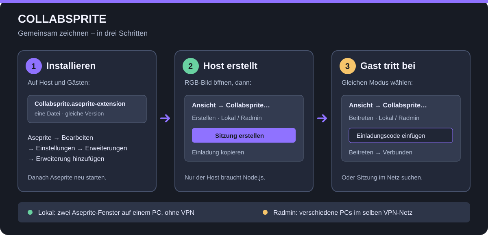

# Collabsprite

[](https://github.com/Merthius/Collabsprite/releases/tag/v0.4.2) [](#voraussetzungen) [](LICENSE) [](https://github.com/Merthius/Collabsprite/actions/workflows/tests.yml)

**Gemeinsam Pixel-Art und Animationen direkt in Aseprite bearbeiten.** Eine Person hostet, die anderen treten bei. Alle nutzen dieselbe Erweiterung und dieselben Rasterebenen und Frames. `Strg+Z`/`Strg+Y` wirken auf die eigenen synchronisierten Pixelaktionen, ohne neuere fremde Pixel zu entfernen.

**[⬇ Collabsprite für Aseprite herunterladen](https://github.com/Merthius/Collabsprite/releases/download/v0.4.2/Collabsprite.aseprite-extension)** · [English guide](README.en.md) · [Probleme & Grenzen](#probleme-und-grenzen)



*Die Grafik zeigt den Ablauf schematisch; sie ist kein Screenshot der Aseprite-Oberfläche.*

> [!IMPORTANT]
> Collabsprite ist eine **Beta für Windows**. Lokal auf einem PC getestet; eine vollständige Verbindung zwischen zwei PCs über Radmin VPN, die automatische Sitzungssuche über VPN und der Fall „Radmin zuvor geschlossen“ sind noch nicht Ende-zu-Ende bestätigt. Speichert eure Arbeit zusätzlich regelmäßig als `.aseprite`-Datei.

## Voraussetzungen

| | Host | Gast |
| --- | --- | --- |
| Aseprite | Ja, getestet mit 1.3.18.6 | Ja |
| Diese Erweiterung | Ja | Ja, **dieselbe Version** |
| [Node.js](https://nodejs.org/) 20+ | Ja | Nein |
| [Radmin VPN](https://www.radmin-vpn.com/) | Nur für verschiedene PCs | Nur für verschiedene PCs |

Keine Cloud-Anmeldung, kein externer Collabsprite-Server und keine separate Host-Erweiterung. **Lokal** verbindet Aseprite-Fenster auf demselben PC über `127.0.0.1:8765`. **Global** verbindet PCs im selben Radmin-VPN über Port `8766`; „Global“ heißt hier *nicht* öffentliches Internet.

## Installation – auf jedem PC

1. Lade auf der [Release-Seite](https://github.com/Merthius/Collabsprite/releases/tag/v0.4.2) unter **Assets** die einzelne Datei **`Collabsprite.aseprite-extension`** herunter. Das automatisch angebotene „Source code (zip)“ ist **nicht** der Installer.
2. Öffne Aseprite → **Bearbeiten → Einstellungen → Erweiterungen → Erweiterung hinzufügen** und wähle die Datei. Ein Doppelklick auf die Datei kann ebenfalls funktionieren ([offizielle Aseprite-Anleitung](https://www.aseprite.org/docs/extensions/)).
3. Starte Aseprite neu. Öffne **Ansicht → Collabsprite…**.

Für Host und Gäste gilt exakt dieselbe Installationsdatei. Nur auf dem Host muss Node.js verfügbar sein.

## Sitzung erstellen – Host

1. Öffne in Aseprite ein **RGB-Bild**. Collabsprite erzeugt beim Start eine **Sitzungskopie**; das Original bleibt unangetastet.
2. Öffne **Ansicht → Collabsprite…**, trage bei **Dein Name** einen Namen ein und wähle **Erstellen**.
3. Wähle **Lokal (dieser PC)** zum Testen mit zwei Aseprite-Fenstern oder **Global (Radmin VPN)** für Freunde auf anderen PCs.
4. Klicke **Sitzung erstellen**. Der Host-Server startet im Hintergrund. Warte auf **Aktive Sitzung: Verbunden**.
5. Klicke **Einladung kopieren** und sende den Code privat an deine Freunde.

Für **Global** müssen alle vorher demselben Radmin-Netzwerk beitreten. Wenn Radmin noch nicht läuft, soll Collabsprite es öffnen; tritt dem VPN-Netz bei und klicke dann erneut **Sitzung erstellen**. Beim ersten globalen Start kann Windows eine einmalige Firewallfreigabe verlangen. Bestätige sie selbst; Collabsprite umgeht diese Abfrage nicht.

## Sitzung beitreten – Gast

1. Installiere dieselbe Erweiterung, starte Aseprite neu und öffne **Ansicht → Collabsprite… → Beitreten**. Ein eigenes Bild musst du dafür nicht öffnen.
2. Wähle denselben Modus wie der Host: **Lokal** auf demselben PC oder **Global** im gemeinsamen Radmin-Netzwerk.
3. Füge den privaten **Einladungscode** ein und klicke **Beitreten**. Du kannst alternativ **Sitzungen suchen** verwenden; falls über Radmin nichts erscheint, nutze den Einladungscode.
4. Warte auf **Verbunden** und zeichne in der neuen Sitzungskopie.

Ein lokaler Code beginnt mit `127.0.0.1:8765/…`, ein Radmin-Code mit einer `26.…:8766/…`-Adresse. Der ganze Code ist ein **Zugangsschlüssel**: nicht öffentlich posten oder in Issues/Screenshots zeigen.

## Gemeinsam arbeiten und speichern

- Normale Aseprite-Werkzeuge wie Stift, Radierer, Füllen und Formen sowie **abgeschlossene** Auswahl-, Einfüge- und Verschiebeaktionen werden geteilt. Während eines gehaltenen Pinselstrichs oder einer schwebenden Auswahl erscheint noch keine Live-Vorschau beim Gegenüber.
- Alle Teilnehmenden können über Aseprites normale Befehle neue Rasterebenen und Frames **am Ende** hinzufügen und vorhandene Ebenen/Frames kopieren. Löschen, Umordnen und einige komplexe Strukturänderungen sind während der Sitzung noch nicht unterstützt.
- `Strg+Z`/`Strg+Y` schalten nur die **eigenen synchronisierten Pixelaktionen** um. Fremde spätere Beiträge bleiben erhalten; neue Ebenen und Frames gehören nicht zu diesem Pixel-Verlauf.
- Speichere die Sitzungskopie über **Datei → Speichern unter** als `.aseprite`, damit Ebenen und Frames erhalten bleiben. Der Host legt zusätzlich automatische Sitzungs-Backups lokal im `data`-Ordner an; sie ersetzen kein eigenes Speichern.
- **Trennen** beendet die Verbindung. Nach einem Netzabbruch gibt es noch keine automatische Wiederverbindung oder Zusammenführung von Offline-Änderungen.

## So funktioniert es

```text
Gast A ── WebSocket ──┐
                     ├── Host-PC: lokaler Collabsprite-Server ── Sitzungskopie + Backup
Gast B ── WebSocket ──┘
       (direkt auf demselben PC oder über das gemeinsame Radmin-VPN)
```

Der Host ordnet und prüft die Änderungen. Die Verbindung benutzt WebSocket **ohne eigene Ende-zu-Ende-Verschlüsselung**; bei verschiedenen PCs muss deshalb ein vertrauenswürdiges VPN genutzt werden. Ein privater Einladungscode schützt die Sitzung zusätzlich. Der lokale Modus bindet nur an `127.0.0.1`; der Radmin-Modus nutzt Port `8766` und eine auf Radmin-Adressen begrenzte Windows-Firewallregel.

## Probleme und Grenzen

| Problem | Prüfen |
| --- | --- |
| **Sitzung erscheint nicht** | Beide im gleichen Modus? Im Radmin-Netz? Sonst den vollständigen Einladungscode einfügen. |
| **Host startet nicht** | Node.js 20+ auf dem Host installieren, Aseprite neu starten, Port 8765/8766 prüfen. |
| **Windows fragt nach Freigabe** | Beim ersten globalen Start ist eine begrenzte Firewallregel nötig; die Abfrage selbst bestätigen. |
| **Aseprite reagiert nicht** | Vergewissere dich, dass Version 0.4.2 installiert ist, speichere ungesicherte Arbeit und melde den genauen Schritt in einem [Issue](https://github.com/Merthius/Collabsprite/issues). |
| **Verbindung weg** | Sitzungskopie speichern; Host/Netz prüfen und bewusst neu beitreten. Offline-Änderungen werden nicht automatisch gemischt. |

Unterstützt werden RGB/RGBA-Rasterebenen. Nicht vollständig synchronisiert werden u. a. Tilemaps, Referenzebenen, Tags, Slices, Farbprofile, verknüpfte Cels, Ebenen-Eigenschaften, Frame-Dauern, Auswahl, Zoom und Farbauswahl. Grenzen: maximal 8 Personen, 1024×1024 Pixel, 32 Ebenen, 120 Frames und 4.194.304 Cel-Pixel. [Technische Details](docs/technical-notes.md).

## Entwickeln und beitragen

```powershell
npm ci
npm test
./build.ps1
```

Der Build legt den Installer im benachbarten Ordner `../output/` ab. `test/` enthält automatisierte Server-/Protokolltests und native Aseprite-Testskripte. Hinweise zu Fehlern und Pull Requests stehen in [CONTRIBUTING.md](CONTRIBUTING.md). **Sitzungsdateien aus `data/`, private Einladungscodes und Bilder gehören nie in ein öffentliches Issue oder einen Commit.**

Collabsprite steht unter der [MIT-Lizenz](LICENSE). Die mit dem Installer ausgelieferte `ws`-Bibliothek steht ebenfalls unter MIT. Dieses Community-Projekt ist nicht offiziell mit Aseprite oder Radmin VPN verbunden.
