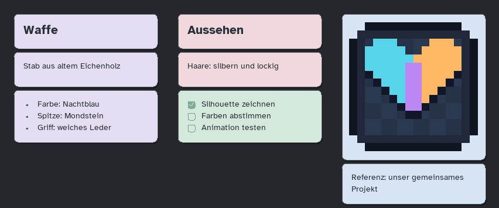

# Collabsprite

> **Neu in 0.10.0 Beta:** Freie Ideenwand mit magnetischen Text-, Listen- und Bildboxen, erweiterte gemeinsame Ebenen-/Animationsbearbeitung und ein geführter Updater. [Versionshinweise](docs/releases/v0.10.0.md).

[](https://github.com/Merthius/Collabsprite/releases/tag/v0.10.0) [](#voraussetzungen) [](LICENSE) [](https://github.com/Merthius/Collabsprite/actions/workflows/tests.yml)

**Gemeinsam Pixel-Art und Animationen direkt in Aseprite bearbeiten.** Eine Person hostet, die anderen treten bei. Alle nutzen dieselbe Erweiterung und dieselben Rasterebenen und Frames. `Strg+Z`/`Strg+Y` wirken auf die eigenen synchronisierten Pixel-, Struktur- und Eigenschaftsänderungen, ohne neuere fremde Pixel zu entfernen.

**[⬇ Collabsprite für Aseprite herunterladen](https://github.com/Merthius/Collabsprite/releases/download/v0.10.0/Collabsprite.aseprite-extension)** · [English guide](README.en.md) · [Probleme & Grenzen](#probleme-und-grenzen)

Version **0.10.0 Beta** enthält alles für **Erstellen und Beitreten in einer Datei**, einschließlich der Host-Laufzeit für Windows x64. Eine separate Node.js-Installation ist nicht erforderlich. Neu: eine **gemeinsame Ideenwand mit magnetischen Text-, Listen- und Bildboxen**, direkt am Bild gespeichert. [Notiz-Tutorial](docs/shared-notes.md).

Die **Diagnosekonsole ist dauerhaft enthalten**: **Ansicht → Collabsprite → Diagnosekonsole → Protokoll kopieren**. Das lokale Protokoll unter `%TEMP%\Collabsprite-debug.log` bleibt nach einem Neustart erhalten und ist auf 512 KiB begrenzt. Es enthält technische Ereignisse und Fehler, keine Bilddaten oder Einladungscodes. **Neues Protokoll** leert die Aufnahme; nur **vor** dem erneuten Auslösen eines Fehlers verwenden. Schutz gegen wiederholte Timer-Aufrufe während Freigabedialogen wurde ergänzt. Ob dies den gemeldeten „C stack overflow“ auf dem betroffenen Freund-PC behebt, bleibt dort zu prüfen.

**Alle Teilnehmenden müssen auf 0.10.0 aktualisieren**: Protokoll **7** ist nicht mit älteren Releases kompatibel. Wiederverbindung, persönlicher Pixel-Verlauf, Löschwiederherstellung, Beitrittssperre und Diagnose bleiben enthalten. [Prüfergebnisse und Grenzen](docs/multiplayer-checklist.md).

## Schnellstart


*Die Grafik zeigt den Ablauf schematisch; sie ist kein Screenshot der Aseprite-Oberfläche.*

> [!IMPORTANT]
> Collabsprite ist eine **Beta für Windows**. Die direkte LAN-Verbindung wurde mit zwei Clients über die LAN-Adresse eines Rechners automatisiert geprüft; ein Ende-zu-Ende-Test mit zwei verschiedenen PCs, Radmin VPN, Firewall-Freigabe und nativer Aseprite-Oberfläche steht noch aus. Speichert eure Arbeit zusätzlich regelmäßig als `.aseprite`-Datei.

## Voraussetzungen

| | Host | Gast |
| --- | --- | --- |
| Aseprite | Ja, getestet mit 1.3.18.6 | Ja |
| Diese Erweiterung | Ja | Ja, **dieselbe Version** |
| Windows 10/11 x64 | Ja, Host-Laufzeit enthalten | Ja |
| [Radmin VPN](https://www.radmin-vpn.com/) | Nur bei verschiedenen Netzwerken | Nur bei verschiedenen Netzwerken |

Keine Cloud-Anmeldung, kein externer Collabsprite-Server und keine separate Host-Erweiterung. Die Sitzung läuft auf dem **Host-PC** (Port `8766`). Es gibt **nur einen Ablauf**: Erstellen oder Beitreten. Im selben WLAN/LAN verbinden sich verschiedene PCs direkt, **ohne Radmin**. Über verschiedene Netzwerke treten beide zuerst demselben Radmin-VPN-Netz bei; danach funktionieren dieselben Schaltflächen. „Lokal“ meint hier die direkte Netzwerkverbindung, nicht zwei Aseprite-Fenster auf einem PC.

## Installation – auf jedem PC

1. Lade auf der [Release-Seite](https://github.com/Merthius/Collabsprite/releases/tag/v0.10.0) unter **Assets** die einzelne Datei **`Collabsprite.aseprite-extension`** herunter. Das automatisch angebotene „Source code (zip)“ ist **nicht** der Installer.
2. Öffne Aseprite → **Bearbeiten → Einstellungen → Erweiterungen → Erweiterung hinzufügen** und wähle die Datei. Ein Doppelklick auf die Datei kann ebenfalls funktionieren ([offizielle Aseprite-Anleitung](https://www.aseprite.org/docs/extensions/)).
3. Starte Aseprite neu. Öffne **Ansicht → Collabsprite → Server erstellen / beitreten**.

Für Host und Gäste gilt exakt dieselbe Installationsdatei. Du kannst jederzeit zwischen Erstellen und Beitreten wählen. Die enthaltene Node.js-Laufzeit (24.21.0) startet nur beim Hosten im Hintergrund.

### Eine ältere Version aktualisieren

1. Sitzungskopie speichern und die laufende Sitzung über **Trennen** beenden.
2. Die neue **`Collabsprite.aseprite-extension`** über **Erweiterung hinzufügen** auswählen und das Update von **pixelkollab-native / Collabsprite** auf **0.10.0** bestätigen. Die technische Kennung `pixelkollab-native` bleibt absichtlich gleich.
3. Aseprite auf **allen beteiligten PCs neu starten**. Unter **Ansicht → Collabsprite → Info** muss **0.10.0** stehen.

**In 0.10.0 enthalten:** **Ansicht → Collabsprite → Update** zeigt ein kompaktes Fortschrittsfenster für Versionsprüfung, Download, Paketprüfung und Installation. Nach dem Download öffnet sich Aseprites Installer automatisch mit der richtigen Datei. Die Installation/Aktualisierung dort bestätigen und anschließend Aseprite neu starten. Kein Suchen im Downloads-Ordner; keine automatische Beendigung deiner Arbeit. Eine laufende Multiplayer-Sitzung vorher über **Trennen** beenden. Die bisherige Installation und Einstellungen werden vorab unter `Aseprite/Collabsprite-backups` gesichert; Sitzungsdaten bleiben unangetastet. Schließen des Fortschrittsfensters vor der Installation verhindert die Installation; ein laufender Download kann noch fertig werden.

**0.8.0 und ältere Versionen** laden über „Update“ nur herunter. Für den ersten Wechsel auf den neuen Update-Ablauf die heruntergeladene `.aseprite-extension` noch einmal wie oben installieren. Bei fehlerhaften Builds das Paket direkt von der Release-Seite laden.

Falls zuvor **„ws 8.21.3“** im Installationsdialog erschien: Das war ein Fehler unserer älteren Pakete. Installiere die korrigierte Datei erneut; ein vorhandener separater „ws“-Eintrag ist keine Collabsprite-Version. Nicht den Quellcode-ZIP verwenden.

## Sitzung erstellen – Host

1. Öffne in Aseprite ein **RGB-Bild**. Collabsprite erzeugt beim Start eine **Sitzungskopie**; das Original bleibt unangetastet.
2. Öffne **Ansicht → Collabsprite → Server erstellen / beitreten**, trage bei **Dein Name** einen Namen ein und wähle **Erstellen**.
3. Nur wenn ihr in **verschiedenen Netzwerken** seid: Starte Radmin VPN und tritt eurem gemeinsamen VPN-Netz bei.
4. Klicke **Sitzung erstellen**. Der Host-Server startet im Hintergrund. Warte auf **Aktive Sitzung: Verbunden**.
5. Klicke **Einladung kopieren** und sende den gesamten Code privat an deine Freunde. Der Code enthält erreichbare LAN- und gegebenenfalls Radmin-Adressen.

Radmin wird nicht automatisch geöffnet: Im LAN wird es nicht gebraucht, und für das VPN musst du selbst das richtige Netzwerk wählen. Beim ersten Start kann Windows eine einmalige Firewallfreigabe verlangen. Bestätige sie selbst; Collabsprite umgeht diese Abfrage nicht. Für direkte LAN-Verbindungen sollte Windows das Netzwerk als **Privat** einstufen.

## Sitzung beitreten – Gast

1. Installiere dieselbe Erweiterung, starte Aseprite neu und öffne **Ansicht → Collabsprite → Server erstellen / beitreten → Beitreten**. Ein eigenes Bild musst du dafür nicht öffnen.
2. Falls ihr nicht im selben LAN seid: Starte Radmin VPN und tritt demselben VPN-Netz wie der Host bei.
3. Füge den privaten **Einladungscode** ein und klicke **Beitreten**. Collabsprite probiert die enthaltenen Adressen der Reihe nach. Du kannst alternativ **Sitzungen suchen** verwenden; falls die Suche nichts zeigt, nutze den Einladungscode.
4. Warte auf **Verbunden** und zeichne in der neuen Sitzungskopie.

Der Einladungscode hat etwa die Form `192.168.1.10:8766,26.1.2.3:8766/RAUM/TOKEN`; ohne aktives Radmin fehlt die `26.…`-Adresse. Der ganze Code ist ein **Zugangsschlüssel**: nicht öffentlich posten oder in Issues/Screenshots zeigen. Wenn Radmin erst später gestartet wird, **Einladung kopieren** erneut anklicken.

## Gemeinsam planen – die Ideenwand

Beim Erstellen oder Beitreten öffnet sich die **Ideenwand**. **X** schließt nur deine Ansicht. Wieder öffnen: **Ansicht → Collabsprite → Gemeinsame Notizen**. Gespeicherte Bildnotizen sind auch ohne Sitzung verfügbar und öffnen sich mit ihrer Datei.



*Mit der nativen Zeichenroutine gerenderte Beispielwand; kein vollständiger Aseprite-Fenster-Screenshot.*

1. **Rechtsklick auf die freie Fläche** → Text, Checkliste, Punktliste, nummerierte Liste oder Referenzbild.
2. **Direkt in die Box schreiben**. Enter ergänzt eine Zeile; Strg+Enter oder Klick daneben übernimmt.
3. **Am Boxrand ziehen**: oben den ganzen Stapel, in der Mitte diese Box mit allem darunter, unten nur die letzte Box. Nahe unter eine andere Box ziehen, um magnetisch anzudocken.
4. **Rechtsklick auf die Box** → Pastellfarbe. Text am Stapelanfang wird automatisch groß und fett.
5. Der **Host speichert die Sitzungskopie als .aseprite**. Bilder und Notizen bleiben zusammen. PNG/Spritesheets enthalten keine Ideenwand.

Eigener Notizverlauf und Feldschutz gegen gleichzeitiges Überschreiben sind enthalten. Unbestätigte Entwürfe sind nicht absturzfest. Alte Notizen werden übernommen; **vor dem ersten Speichern eine Dateikopie behalten**, da ältere Versionen das neue Format nicht bearbeiten können. [Bedienung und Grenzen](docs/shared-notes.md).

## Gemeinsam arbeiten und speichern

Der Host speichert das gemeinsame Bild. Bei Gästen blockiert Collabsprite die normalen Speicher- und Exportbefehle für das Sitzungsbild, auch nach einem Verbindungsabbruch. Beim regulären **Trennen** wartet der Gast auf die Bestätigung seiner letzten Änderungen und schließt dann nur seine Sitzungsansicht. Bereits bestätigte Beiträge bleiben beim Host und im Server-Backup. Bei fehlender Bestätigung bleibt das Bild offen; ein Absturz oder hartes Beenden kann ungesendete Änderungen weiterhin verlieren.

**Kein Kopierschutz:** Zum Bearbeiten empfängt Aseprite auf dem Gast-PC die Bilddaten. Screenshots, Zwischenablage, Skripte, Aseprites Wiederherstellungsdaten oder eine veränderte/deaktivierte Erweiterung lassen sich damit nicht zuverlässig verhindern. Nur vertrauenswürdige Personen einladen. Die Speicherregel ist eine Bedienungssperre, keine Sicherheitsgarantie; sie gilt nicht rückwirkend für ältere Clients.

- Normale Aseprite-Werkzeuge wie Stift, Radierer, Füllen und Formen sowie **abgeschlossene** Auswahl-, Einfüge- und Verschiebeaktionen werden geteilt. Während eines gehaltenen Pinselstrichs oder einer schwebenden Auswahl erscheint noch keine Live-Vorschau beim Gegenüber.
- Alle können über die normalen Aseprite-Befehle Rasterebenen und Gruppen anlegen, umsortieren, duplizieren oder löschen; Frames auch mittig einfügen und umordnen. Verknüpfte Cels an derselben Position, Animationstags, Größenänderung, Zuschnitt und Rasterebenen-Zusammenführen werden geteilt. Ebenen-/Frame-/Cel-Eigenschaften und die erste Palette bleiben synchronisiert. [Details](docs/cooperative-editing.md).
- `Strg+Z`/`Strg+Y` gelten für eigene synchronisierte Pixel-, Struktur- und Eigenschaftsänderungen. Rücknahmen, die neuere fremde Beiträge entfernen würden, werden abgewiesen. Ein Strukturkonflikt bleibt als separater lokaler Entwurf-Tab erhalten.
- Der **Host** speichert die Sitzungskopie über **Datei → Speichern unter** als `.aseprite`, damit Ebenen und Frames erhalten bleiben. Er legt zusätzlich automatische Sitzungs-Backups lokal im `data`-Ordner an; sie ersetzen kein eigenes Speichern. Ältere Sicherungen blockieren keinen neuen Hoststart; Collabsprite lädt die acht zuletzt geänderten Sitzungen und lässt ältere Dateien unangetastet.
- Wenn der Host das Sitzungsbild oder Aseprite schließt, wird der Hintergrundserver nach dem Backup beendet und Port `8766` wieder frei. Die Gäste werden getrennt; ihre bereits bestätigten Beiträge bleiben im gemeinsamen Host-Bild und dessen Backup.
- **Letzte Löschung wiederherstellen** unter **Ansicht → Collabsprite** fügt gelöschte Ebenen/Frames zurück, ohne neuere Zeichnungen in den übrigen Cels zurückzusetzen. Für alle Teilnehmenden verfügbar; die zuletzt ausgeführte gemeinsame Löschung zuerst. Bis zu 20 Löschaktionen / insgesamt 4.194.304 gelöschte Cel-Pixel, nur solange der Server läuft. Wiederhergestellte Pixel bilden eine neue Basis; ihr früherer Pixel-Undo wird nicht mit wiederhergestellt.
- Nach einem **kurzen Netzabbruch** verbindet Collabsprite bis zu zwei Minuten lang automatisch neu: derselbe Tab, dieselbe Identität und der noch verfügbare eigene Pixel-Verlauf. Bestätigte Striche werden nicht doppelt angewendet; noch ausstehende werden über feste Ebenen-/Frame-Kennungen abgeglichen. Währenddessen pausiert die Bearbeitung. Wenn genau das Ziel eines unbestätigten Strichs gelöscht wurde oder das Bild trotz Pause lokal verändert wurde, bleibt die Ansicht offen und der Abgleich stoppt sicher. Kein allgemeines Offline-Merging.
- **Trennen** beendet die Sitzungsteilnahme bewusst. Automatische Wiederaufnahme gilt nicht nach absichtlichem Verlassen, Aseprite-/Server-Neustart oder abgelaufener Frist. Nach einem harten Host-Absturz kann der Server noch bis zu zwei Minuten auf eine Wiederverbindung warten, bevor er beendet wird; beim regulären Schließen wird er sofort nach dem Backup beendet.

## So funktioniert es

```text
Gast-PC A ── LAN oder Radmin VPN ──┐
                                  ├── Host-PC: Collabsprite-Server ── Sitzungskopie + Backup
Gast-PC B ── LAN oder Radmin VPN ──┘
```

Der Host ordnet und prüft die Änderungen. Die Verbindung benutzt WebSocket **ohne eigene Ende-zu-Ende-Verschlüsselung**; nutzt deshalb nur ein vertrauenswürdiges LAN oder VPN. **Offene Sitzungen verteilen ihre Einladung über die Netzwerksuche an erreichbare Teilnehmer dieses Netzes.** Der Code alleine macht eine offene Sitzung deshalb nicht privat gegenüber anderen Netzwerkteilnehmern. Der Host kann **„Beitritte erlauben“** ausschalten: Die Sitzung verschwindet aus der Suche, weitere Beitritte mit bekanntem Code werden ebenfalls abgelehnt. Bestehende Gäste können weiterarbeiten und innerhalb ihrer Frist wiederverbinden. Die Windows-Firewall erlaubt Port `8766` nur für den benötigten Node-Prozess, im **lokalen Subnetz** auf privaten/Domain-Netzen und für **Radmin-Adressen** (`26.0.0.0/8`). Keine Router-Portweiterleitung ins öffentliche Internet einrichten.

## Probleme und Grenzen

| Problem | Prüfen |
| --- | --- |
| **Sitzung erscheint nicht** | Beide PCs im selben LAN oder Radmin-Netz? Sonst den vollständigen Einladungscode einfügen. VPN-Broadcast kann scheitern. |
| **Host startet nicht** | Aktuellen Installer erneut installieren, Aseprite neu starten und Diagnosekonsole öffnen; die Host-Laufzeit ist enthalten. |
| **Windows fragt nach Freigabe** | Beim ersten Start ist eine begrenzte Firewallregel nötig; die Abfrage selbst bestätigen. |
| **LAN-Gast erreicht den Host nicht** | Windows-Netzwerkprofil auf dem Host auf **Privat** prüfen; Host-Firewall und WLAN-Client-Isolation prüfen. |
| **„C stack overflow“ beim Beitreten** | Aktualisiere Host und Gäste auf dieselbe Version. Nach dem Fehler **Diagnosekonsole → Protokoll kopieren**; Aseprite-Version und genauen Schritt in einem [Issue](https://github.com/Merthius/Collabsprite/issues) ergänzen. |
| **Aseprite reagiert nicht** | Speichere ungesicherte Arbeit und melde den genauen Schritt in einem [Issue](https://github.com/Merthius/Collabsprite/issues). |
| **Verbindung weg** | Bis zu zwei Minuten auf automatische Wiederverbindung warten und Netzwerk/Host prüfen. Bei Abbruch lokale Ansicht nicht voreilig schließen, Diagnose kopieren; Host speichert. Kein allgemeines Offline-Merging. |

Unterstützt werden RGB/RGBA-Rasterebenen. Nicht vollständig synchronisiert werden u. a. Tilemaps, Referenzebenen, Slices, Farbprofile, versetzt verknüpfte Cels und animierte Paletten. Auswahl, Zoom und Farbauswahl sind persönliche Arbeitsansichten. Grenzen: maximal 8 Personen einschließlich kurz unterbrochener Teilnehmer, 1024×1024 Pixel, 32 Ebenen, 120 Frames und 4.194.304 Cel-Pixel. Ideenwand: bis 128 Boxen und 8 MiB inklusive Papierkorb; Referenzen bis 512×512 Pixel. Bei Netzabbruch während einer unbestätigten Strukturaktion bleibt die lokale Fassung erhalten; dafür gibt es noch keine automatische Wiederaufnahme. **0.10.0 verwendet Protokoll 7; frühere Sitzungen sind nicht kompatibel.** [Technische Details](docs/technical-notes.md).

## Entwickeln und beitragen

```powershell
npm ci
npm test
./build.ps1
```

Der Build legt den Installer im benachbarten Ordner `../output/` ab. `test/` enthält automatisierte Server-/Protokolltests und native Aseprite-Testskripte. Hinweise zu Fehlern und Pull Requests stehen in [CONTRIBUTING.md](CONTRIBUTING.md). **Sitzungsdateien aus `data/`, private Einladungscodes und Bilder gehören nie in ein öffentliches Issue oder einen Commit.**

Collabsprite steht unter der [MIT-Lizenz](LICENSE). Die mit dem Installer ausgelieferte `ws`-Bibliothek steht ebenfalls unter MIT; die unveränderte Node.js-Laufzeit enthält ihre vollständigen Lizenzhinweise in `runtime/LICENSE`. Die Ideenwand-Schrift Atkinson Hyperlegible steht unter der [SIL Open Font License](extension/notes-font-OFL.txt). Dieses Community-Projekt ist nicht offiziell mit Aseprite oder Radmin VPN verbunden.

## Logo

Die türkise und die orange Hälfte ergeben zusammen ein Pixel-Herz – zwei Menschen, ein gemeinsames Bild. Für Discord und andere Projektlisten kannst du das [Logo als PNG (512 × 512)](branding/collabsprite-icon-512.png) oder als [skalierbare SVG](branding/collabsprite-icon.svg) verwenden. Das [GitHub-Vorschaubild](branding/collabsprite-social-preview.png) ist ebenfalls im Repository. Die Grafiken sind wie der Code MIT-lizenziert.
