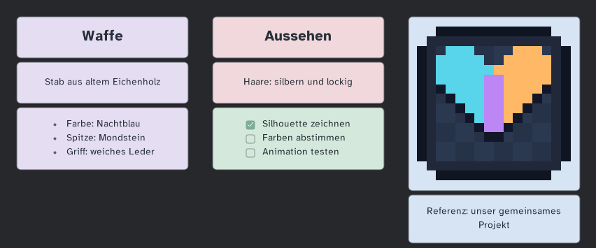

# Collabsprite 0.10.1 Beta – kompaktere Oberfläche

**Ein Installer für Host und Gäste, inklusive Windows-x64-Hostlaufzeit und Diagnose.** Protokoll 7 und Notizformat 2 bleiben unverändert; kompatibel mit 0.10.0.

## Herunterladen und aktualisieren

1. **[Collabsprite.aseprite-extension herunterladen](https://github.com/Merthius/Collabsprite/releases/download/v0.10.1/Collabsprite.aseprite-extension)** – nicht „Source code (zip)“. Für Host und Gäste dieselbe Datei verwenden.
2. Arbeit speichern und eine laufende Collabsprite-Sitzung über **Trennen** beenden.
3. In Aseprite **Bearbeiten → Einstellungen → Erweiterungen → Erweiterung hinzufügen** öffnen und die Datei auswählen. Die Aktualisierung von **pixelkollab-native / Collabsprite** bestätigen.
4. Aseprite neu starten. **Ansicht → Collabsprite → Info** zeigt **0.10.1**. Alternativ führt **Ansicht → Collabsprite → Update** durch Download und Installation; die native Bestätigung und der Neustart bleiben erforderlich.

Im selben LAN/WLAN ohne VPN; über verschiedene Netzwerke vorher demselben Radmin-VPN-Netz beitreten. **[Host-/Gast-Anleitung](https://github.com/Merthius/Collabsprite/blob/v0.10.1/README.md#schnellstart)**.

## Änderungen

- Ideenwand, Sitzung, Update, Info, Diagnose und Textvergleich starten mit begrenzten Größen. Lange Texte/Namen blähen die Oberfläche nicht mehr auf.
- Keine doppelte Vergrößerung der Ideenwand durch Aseprites UI-Skalierung. Geglättete Rundungen und supersampelte, für die jeweilige Zoomgröße gerasterte Schrift.
- Text horizontal und vertikal zentriert. Text am Anfang eines Stapels automatisch größer und fett; darunter normale Schrift. Listen bilden einen mittig platzierten, lesbar ausgerichteten Block.
- Kleines dunkles Kontextmenü, passende Aktionen und Untermenüs für Listen. Sieben Pastellfarben bleiben direkt erreichbar.
- Korrekte Textauswahl/Cursorposition und anklickbare Checklisten auch bei umbrochenen Zeilen.
- Keine Änderungen an Bildern, Netzwerkprotokoll, persönlichen Undo-Verläufen oder Notizspeicherung.

## Geprüft

60 Node-Tests, 12 native Aseprite-Batchskripte, Paketbau, Update- und Hintergrundstart-/Serverende-Test bestanden. Größenberechnung für Fenster von 640×480 bis 2880×1648 bei UI-Skalierungen 1/2/3 geprüft. Sichtbare Ideenwand-/Kontextmenüprobe in einer separaten Aseprite-1.3.18.6-Testkopie; keine Installation in der normalen App. Zwei echte PCs und längere gemeinsame Sitzungen bleiben separate offene Prüfungen.

Die native Aseprite-Bildschirmvergrößerung kann weiterhin einzelne Bildschirmpixel vergrößern. Diese Erweiterung ändert keine persönlichen Skalierungs- oder Theme-Einstellungen; Betriebssystem- und Sicherheitsdialoge gehören nicht zur eigenen Oberfläche.

## Versionsnummer

`0.10.0` bedeutet Hauptversion 0, Funktionsstand 10, Korrekturstand 0 – keine Dezimalzahl. Auf `0.9.0` kann daher `0.10.0` folgen. Die Oberflächenkorrektur heißt `0.10.1`; `1.0.0` bleibt für einen ausreichend erprobten stabilen Stand vorgesehen. Bestehende veröffentlichte Tags werden nicht umbenannt.
