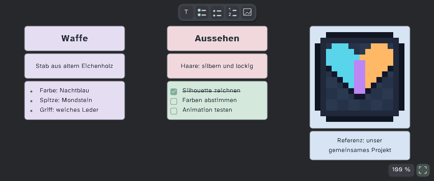

# Collabsprite 0.11.0 Beta – Ideenwand und Diagnose

**Ein Installer für Host und Gäste.** Windows x64; Host-Laufzeit und Diagnose sind enthalten. Netzwerkprotokoll **7** und Notizformat **2** bleiben erhalten. Die Zeichen-Sitzung ist zu 0.10.0/0.10.1 kompatibel; für dieselben Werkzeuge und Diagnosefunktionen auf allen PCs 0.11.0 installieren.

## Herunterladen

1. Unter **Assets** nur [Collabsprite.aseprite-extension](https://github.com/Merthius/Collabsprite/releases/download/v0.11.0/Collabsprite.aseprite-extension) herunterladen – nicht „Source code (zip)“.
2. Bild speichern und eine laufende Sitzung trennen. In Aseprite **Bearbeiten → Einstellungen → Erweiterungen → Erweiterung hinzufügen** öffnen, die Datei wählen und die Aktualisierung bestätigen.
3. Aseprite auf Host und Gästen neu starten. **Datei → Multiplayer (Collabsprite) → Info** muss **0.11.0** zeigen. Der integrierte Updatebefehl kann den Download und Aseprites Installer ebenfalls starten; die native Bestätigung und der Neustart bleiben nötig.

Im selben LAN/WLAN direkt verbinden; über verschiedene Netzwerke zuvor demselben Radmin-VPN-Netz beitreten. [Host-/Gast-Anleitung](../../README.md#schnellstart).

## Neu

- **Ideenwand:** Kleine Werkzeuginsel für Text, Check-/Punkt-/Nummernliste und Referenzbild. Rechtsklick auf freie Fläche fügt kopierte Elemente, fremden Text oder ein Bild ein. Ein Auswahlrechteck markiert mehrere Boxen für gemeinsames Verschieben, Kopieren, Duplizieren oder Löschen.
- **Bessere Übersicht:** Boxen und Schrift bleiben bei 45 % Zoom lesbarer; rechts unten stehen Zoomwert und „Alle Boxen“. Nummernliste mit 1/2-Symbol, abgehakte Checklisten-Texte durchgestrichen, sieben kräftigere Farbfelder direkt im Box-Kontextmenü. Frühere gespeicherte Farben bleiben erhalten.
- **Auffindbar:** Alle Erweiterungsfunktionen liegen nun unter **Datei → Multiplayer (Collabsprite)**, mit Trennstrich vor dem Eintrag oberhalb von Aseprites Skript-Menü.
- **Diagnose:** Im Fenster per Mausrad, Scrollleiste oder Bild-auf/Bild-ab ältere Einträge ansehen. **Protokoll kopieren** nimmt nur den aktuellen Host-/Beitrittsversuch (vorher: aktuellen Aseprite-Start). Die ältere lokale Protokollhistorie bleibt zur Ansicht erhalten, bis sie rotiert oder bewusst mit **Leeren** gelöscht wird. Keine Pixel-/Bilddaten oder Einladungscodes im Protokoll.

## Geprüft und Grenzen

Automatisierte Node-, native Aseprite-Batch-, Updater- und isolierte Paket-Hoststarttests; Diagnose-Tests für Scrollen, Kopiergrenze, Rotation und Redaktionen. Die Beispielwand wurde mit Aseprites nativer Zeichenroutine gerendert. Ein sichtbarer Endnutzer-Maustest der neuen Oberfläche sowie ein echter Zwei-PC-/Radmin-Dauertest stehen weiter aus. Der früher gemeldete „C stack overflow“ auf dem Freund-PC ist damit **nicht** als behoben bestätigt.

Das Diagnoseprotokoll auf der Festplatte bleibt auf 512 KiB begrenzt; die kopierte aktuelle Sitzung auf 384 KiB. Bei sehr langen Sitzungen werden die ältesten Einträge rotiert/gekürzt. Bilder und Sitzungsdaten gehören nicht in öffentliche Issues; nur das bereinigte Diagnoseprotokoll teilen.
