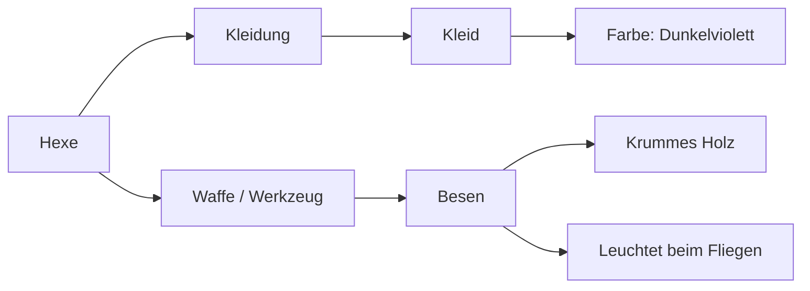

# Gemeinsame Ideenwand

Ab **Collabsprite 0.8.0 Beta** planen Host und Gäste am selben Bild. Kein Chat, kein zusätzlicher Dienst: verbundene Karten halten eure Ideen fest.

*Schematisches Beispiel, kein Screenshot. Mehrere unabhängige Hauptkarten sind möglich.*

## In fünf Schritten

1. Beide Seiten installieren dieselbe **0.8.0**, starten Aseprite neu und erstellen/öffnen eine Sitzung. Die Ideenwand öffnet sich einmal automatisch.
2. **+ Karte** wählen. Rechtsklick auf die Karte → **Titel ändern** → „Hexe“ → **Übernehmen**.
3. Rechtsklick → **+ Unterkarte** für „Kleidung“. Darunter „Kleid“ ergänzen. An „Hexe“ einen zweiten Unterzweig für „Besen“ hinzufügen. Die Verbindung entsteht automatisch.
4. **Doppelklick** auf eine Karte öffnet den Texteditor mit sechs Eingabezeilen. **Übernehmen** sendet den Text gemeinsam; **Später** behält den Entwurf lokal. Titel, HEX-Farbe, Status oder übergeordnete Karte per Rechtsklick ändern. Ein anderer Elternknoten ordnet die Karte neu zu; Kreisverbindungen werden abgelehnt.
5. Der Host speichert **die Sitzungskopie als `.aseprite`**. Öffnet er diese Datei später, gehört die richtige Wand wieder dazu. Beim Start einer neuen Sitzung erhalten neue Gäste diese gespeicherten Notizen.

## Übersicht behalten

| Aktion | Bedienung |
| --- | --- |
| Karte verschieben | Karte ziehen; neue Position wird geteilt |
| Ausschnitt bewegen | Leere Fläche ziehen |
| Vergrößern/verkleinern | Mausrad über der Wand |
| Gesamte Wand sehen | **Alles anzeigen** |
| Karten verteilen | **Anordnen**; Positionen werden gemeinsam geändert |
| Idee finden | **Suche** hebt passende Titel/Texte hervor |
| Zweig verbergen | Rechtsklick → **Zweig einklappen**; nur eigene Ansicht |
| Text vollständig lesen | Doppelklick; verkleinerte Karten zeigen weniger Vorschau |
| Farbe/Status | Rechtsklick → **Farbe ändern** / **Status ändern**; `#RRGGBB` oder leer, Idee/Festgelegt/Erledigt |
| Wieder öffnen | **Ansicht → Collabsprite → Gemeinsame Notizen** |

Die Wand ist ein schließbares, nicht angedocktes Aseprite-Fenster. **X löscht nichts und trennt niemanden.** Das Zeichnen bleibt möglich. Die Zeile **Bild:** ordnet die Wand ihrem Bild zu. Jedes Bild hat einen eigenen Zustand; Zoom, Suche und eingeklappte Zweige sind persönlich.

## Ohne gegenseitiges Überschreiben

Alle dürfen alle Karten bearbeiten. Beim Öffnen eines Feldes reserviert Collabsprite nur dieses Feld kurzzeitig. Ein kleiner Name zeigt fremde Bearbeitung an; andere Felder bleiben frei. Die Reservierung wird während des Schreibens erneuert und endet beim Schließen, Trennen oder nach höchstens 15 Sekunden ohne Erneuerung.

Veraltete Änderungen werden abgelehnt, nicht still über fremden Text geschrieben. Der Entwurf bleibt offen: **Stand vergleichen** zeigt den gemeinsamen Wert; danach bewusst übernehmen, kopieren oder verwerfen. Wurde die ganze Karte gelöscht, lässt sich der Entwurf weiterhin kopieren. Bestätigte Kartenänderungen werden sofort an alle übertragen; Text wird erst mit **Übernehmen**, nicht bei jedem Tastendruck, geteilt.

**Notiz zurück / Vor** betreffen nur deinen Notizverlauf, nicht die Zeichnung. Mit Fokus auf der Kartenfläche gehen auch `Strg+Z`/`Strg+Y`. Neuere fremde Änderungen werden nicht überschrieben; eine widersprechende Rücknahme wird abgelehnt. Bis 32 eigene Aktionen und 4 MiB Verlauf je Person, nur während der laufenden Sitzung bzw. lokalen Notizbearbeitung.

Beim Löschen wählt ihr **Unterkarten behalten** oder **Ganzen Zweig löschen**. Der **Papierkorb** behält bis zu 20 Löschgruppen im Rahmen des Gesamtlimits und wird mitgespeichert. Wiederherstellung fügt fehlende Karten zurück. Bereits anderweitig wiederhergestellte Karten werden nicht überschrieben. Ist die frühere Elternkarte nicht mehr vorhanden, wird die Karte zur Hauptkarte.

## Was gespeichert ist – und was noch nicht

- **Entwurf:** nur in der laufenden App, noch nicht gemeinsam. Vor normalem Trennen, Schließen oder Speichern erst übernehmen oder ausdrücklich verwerfen. **Kein Schutz vor Verlust durch Absturz oder erzwungenes Beenden.**
- **Wird übertragen:** wartet auf den Host. Kurze Wiederverbindung sendet eine ausstehende Aktion mit derselben Kennung; bereits bestätigte Aktionen werden nicht doppelt angewendet.
- **Mit Host synchronisiert:** Teil des gemeinsamen Zustands und des nächsten Host-Backups, aber nicht automatisch Teil eurer manuell gespeicherten Bilddatei.
- **In Datei gespeichert (Host):** der Host hat diese Notizversion mit dem Bild gespeichert. Neue Notizänderungen machen diesen Stand wieder ungespeichert.

**`.aseprite` / `.ase` enthalten die Wand innerhalb der Datei.** Umbenennen, Verschieben und „Speichern unter“ erhalten die Notizen. Unabhängige Dateikopien werden nicht dauerhaft miteinander gekoppelt. Fremde Erweiterungseigenschaften werden nicht überschrieben. PNG, GIF und Spritesheets sind Bildexporte; zusätzlich `.aseprite` behalten. Der Host speichert, Gäste behalten die bisherige normale Speicher-/Exportsperre – weiterhin kein Kopierschutz.

Bestätigte Gastbeiträge bleiben beim Host, wenn der Gast geht. Lokale Notizen funktionieren auch ohne aktive Sitzung. Aseprites gewöhnliches lokales Dokument-Undo kann dabei ebenfalls gespeicherte Eigenschaftsänderungen zurücknehmen; dann verwirft die Ideenwand ihren nicht mehr passenden lokalen Zusatzverlauf. In einer aktiven Sitzung bleiben Pixel- und Notiz-Undo getrennt.

## Grenzen und Teststand

128 Karten, 24 Hierarchieebenen, insgesamt 512 KiB einschließlich Papierkorb. Titel maximal 120 UTF-8-Bytes, Notiztext 2048 Bytes; Umlaute benötigen mehr als ein Byte. Die Texte werden nicht als Code ausgeführt und nicht ins Diagnoseprotokoll geschrieben. Die erste Version enthält keine Anhänge, frei gezeichneten Verbindungen, zusätzlichen Kommentare oder Chat.

Geprüft: drei echte native Aseprite-WebSockets auf einem Rechner, parallele Felder, Reservierungen, eigener Verlauf, späterer Beitritt, verlorene Bestätigung/Resume und Gast-Austritt. Separat native Datei-Roundtrips, Save As, unveränderte Fremd-Eigenschaften, Bildkopie und UI-Bedienung. **Zwei physische PCs/Radmin und längere Praxis bleiben offene Tests.** [Vollständiger Prüfstand](multiplayer-checklist.md).
